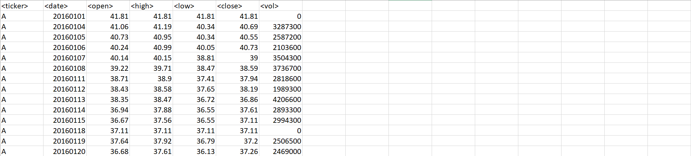
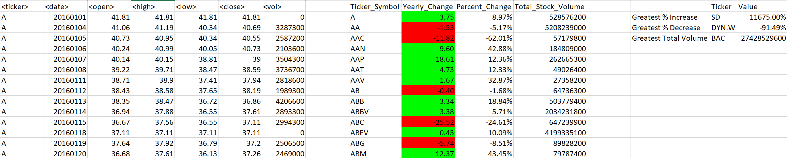

# Unit 2 | VBA Macros Designed to Automate Excel Workbook/Sheet Summaries
macro designed to automate the analysis of an entire excel workbook

There are two macros provided
*book_stock_summaries.bas - made to iterate through entire workbook and populate a summaries table
*stock_summaries.bas = made to iterate through a single worksheet and populate a summaries table

### Original Spreadsheet

### After Applying Macro

